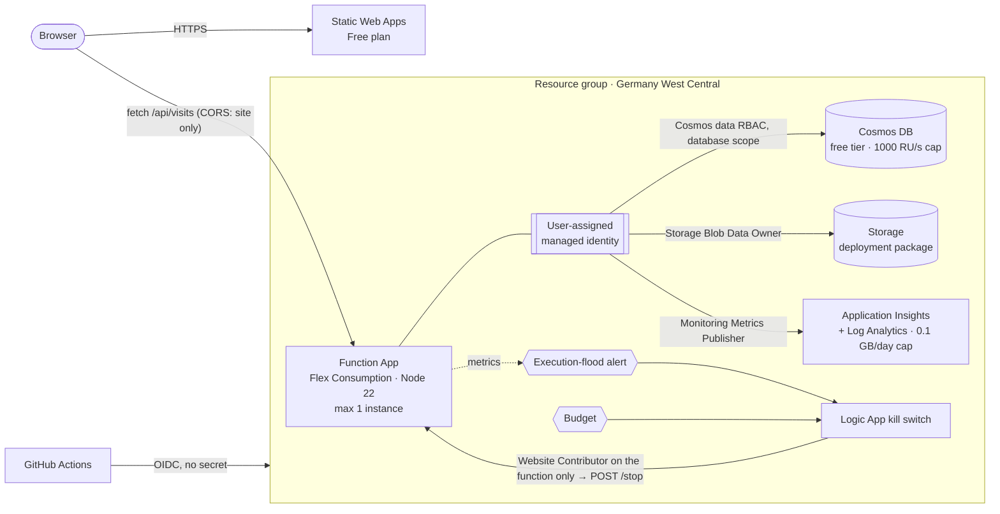

# Azure Cloud Resume

[](https://github.com/314159DD/azure-cloud-resume/actions/workflows/ci.yml)
[](https://github.com/314159DD/azure-cloud-resume/actions/workflows/deploy.yml)

My resume as a small, production-grade Azure workload: a static site with a visitor counter API, built
the way I would build a real system for a client. **No secrets anywhere, all infrastructure as code,
cost that is capped by design, and every claim below verified against the live deployment.**

Live: https://victorious-glacier-013ec1c0f.6.azurestaticapps.net

## Architecture



| Layer | Choice | Why |
|---|---|---|
| Hosting | Static Web Apps (Free) | Global static hosting that cannot incur charges |
| API | Azure Functions, Flex Consumption, TypeScript | Scale to zero, identity-based host storage, hard scale caps ([ADR 1](docs/adr/0001-flex-consumption-for-the-api.md)) |
| Data | Cosmos DB for NoSQL, free tier | Atomic server-side increment ([ADR 5](docs/adr/0005-atomic-counter.md)), throughput ceiling at the free size |
| Identity | User-assigned managed identity, keys disabled | No credentials to leak or rotate ([ADR 2](docs/adr/0002-managed-identity-everywhere.md)) |
| IaC | Bicep modules, PSRule for Azure | Reviewable, reproducible, checked against Well-Architected rules |
| CI/CD | GitHub Actions with OIDC | No stored secret, least-privilege deployer ([ADR 3](docs/adr/0003-oidc-and-constrained-rbac-for-ci.md)) |
| Cost | Caps, budget, automatic kill switch | Guardrails that stop, not just warn ([ADR 4](docs/adr/0004-cost-guardrails-and-kill-switch.md)) |

## Security model

- **Zero secrets.** Storage (`allowSharedKeyAccess: false`), Cosmos DB and Application Insights (`disableLocalAuth: true`)
  reject key-based access. The function reaches them through its managed identity; nothing sensitive lives in
  app settings, the repository or GitHub.
- **Least privilege, scoped to the resource.** The function holds three data-plane roles, each on a single
  resource (Cosmos DB: one database). The kill switch can only stop/start the one function app.
- **Deployer cannot escalate.** GitHub Actions signs in via OIDC for two subjects only (`environment:production`,
  `pull_request`). It is Contributor on the resource group plus an RBAC administrator **constrained by an ABAC
  condition** to the three roles the templates assign, so it cannot grant itself Owner.
- **Browser hardening.** CORS admits the site's origin only; the site ships a strict Content-Security-Policy,
  HSTS and related headers ([`staticwebapp.config.json`](web/staticwebapp.config.json)).
- **Supply chain.** Every GitHub Action is pinned to a commit SHA; Dependabot updates npm packages and actions;
  CodeQL scans the code; `npm audit` gates CI.

## Cost model

Idle cost is effectively zero. The question that matters is the worst case and what stops it:

| Resource | Worst case without guardrail | Guardrail | Type |
|---|---|---|---|
| Function compute | unbounded scale-out | 1 instance × 512 MB, 10 concurrent requests | hard |
| Function executions | billed per million, unbounded | alert at 1,500 executions / 5 min → kill switch stops the app | automated |
| Cosmos DB | RU/s billed above free tier | `totalThroughputLimit: 1000` → excess gets HTTP 429 | hard |
| Log ingestion | billed per GB | 0.1 GB daily cap | hard |
| Static site | – | Free plan | hard |
| Everything | – | budget: e-mail at 20 %, forecast alert, kill switch at 100 % | automated, lags hours |

## Verified behaviour

Checked against the deployed system, not just in tests:

| Claim | How it was verified |
|---|---|
| No lost updates | 20 concurrent POSTs → counter +20 (also part of the post-deploy smoke test) |
| No key fallback | Removing the Cosmos data role → API fails immediately; restoring it via redeploy → works |
| Drift detection | A manually deleted role shows up as `Create` in `what-if`; redeploy restores it |
| CORS | Site origin receives `Access-Control-Allow-Origin`, a foreign origin does not |
| Scale caps | Flood of 3,600 requests is throttled to about 12 requests/s by the caps |
| Kill switch | Flood → alert fires → Logic App stops the function → API returns 403 until started again |

The kill switch needed two fixes that only a real flood test revealed: the first threshold sat just above what
the scale caps let through, and the action group had been given the workflow's callback URL instead of the
trigger's. Both are documented in [ADR 4](docs/adr/0004-cost-guardrails-and-kill-switch.md) and in the templates.

## Deploy

Prerequisites: Azure CLI, Node 22, an Azure subscription where you are Owner.

1. **Bootstrap once** (resource group, OIDC identity, constrained roles):
   ```powershell
   az login
   ./scripts/bootstrap.ps1 -GitHubRepo <owner>/<repo>
   ```
2. **Configure the repository**: variables `AZURE_CLIENT_ID`, `AZURE_TENANT_ID`, `AZURE_SUBSCRIPTION_ID` (printed by
   the bootstrap) and `AZURE_RESOURCE_GROUP=rg-cloudresume`, plus an environment named `production`. These are
   identifiers, not credentials. The only secret is `BUDGET_ALERT_EMAIL`, stored as a secret purely so the address
   is masked in public workflow logs. There is no credential of any kind in GitHub.
3. **Push to `main`.** `deploy.yml` provisions the infrastructure, deploys the API and the site, and runs
   [`scripts/smoke-test.sh`](scripts/smoke-test.sh) against the live system.

Pull requests run lint, typecheck, unit tests, `npm audit`, Bicep lint, PSRule for Azure and post an
`az deployment group what-if` summary as a comment, separating resource-level changes from property noise.

Local development: `cd api && npm ci && npm test`. Tear down with `./scripts/teardown.ps1`.

## Deliberate trade-offs

This is a single-region, free-tier workload. PSRule for Azure passes all 118 applicable rules; nine rules are
excluded on purpose, each with its reason in [`ps-rule.yaml`](ps-rule.yaml):

- **No zone or geo redundancy** (Functions, Cosmos DB, Storage, Log Analytics): a visitor counter tolerates a
  regional outage, redundancy would multiply cost.
- **No private endpoints / VNet integration**: billed per hour. Compensated by disabling key auth everywhere and
  RBAC-only access.
- **No SLA** on the Cosmos DB free tier.
- **Regions**: data stays in Germany West Central; the Static Web Apps Free plan is not offered there, so the site
  resource lives in East US 2 (content is served globally either way).

## Repository layout

```
api/                 Azure Function (TypeScript): domain logic, Cosmos adapter, tests
web/                 Static site (EN/DE), security headers
infra/               Bicep: main.bicep + modules (monitoring, storage, cosmos, functionapp, staticwebapp, killswitch, budget)
scripts/             bootstrap, teardown, smoke test, what-if summary
docs/adr/            Architecture decision records
.github/workflows/   CI, deploy, CodeQL
```

## How this was built

Architecture, decisions and verification are mine. The implementation was pair-programmed with
[Claude Code](https://claude.com/claude-code); every change was reviewed, deployed and verified against the live
system as described above.

## License

[MIT](LICENSE)
