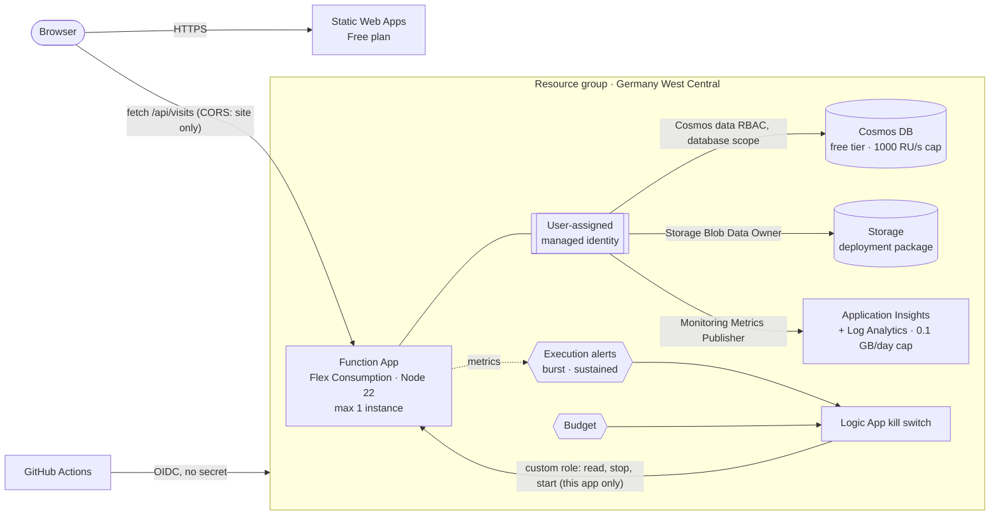

# Azure Cloud Resume

[](https://github.com/314159DD/azure-cloud-resume/actions/workflows/ci.yml)
[](https://github.com/314159DD/azure-cloud-resume/actions/workflows/deploy.yml)

My resume, hosted as a small Azure workload: a static site plus a visitor counter API. I built it the way I
would build a client system. There are no secrets in the code, the configuration or GitHub, the workload's
resources are defined in Bicep, spending has hard limits, and the behaviour described below was tested against
the live deployment, with the results and scripts in [docs/verification.md](docs/verification.md).

Live: https://victorious-glacier-013ec1c0f.6.azurestaticapps.net

## Architecture



| Layer | Choice | Why |
|---|---|---|
| Hosting | Static Web Apps (Free) | Global static hosting on a plan that cannot incur charges |
| API | Azure Functions, Flex Consumption, TypeScript | Scales to zero, uses identity-based host storage and has hard scale caps ([ADR 1](docs/adr/0001-flex-consumption-for-the-api.md)) |
| Data | Cosmos DB for NoSQL, free tier | Atomic server-side increment ([ADR 5](docs/adr/0005-atomic-counter.md)) and a throughput ceiling at the free size |
| Identity | User-assigned managed identity, keys disabled | Nothing to leak or rotate ([ADR 2](docs/adr/0002-managed-identity-everywhere.md)) |
| IaC | Bicep modules, checked by PSRule for Azure | Reviewable and reproducible |
| CI/CD | GitHub Actions with OIDC | No stored credential, no cloud access for pull requests, and a deployer that cannot make itself Owner ([ADR 3](docs/adr/0003-oidc-and-constrained-rbac-for-ci.md)) |
| Cost | Scale caps, budget, automatic kill switch | Spending stops on its own when traffic looks like abuse ([ADR 4](docs/adr/0004-cost-guardrails-and-kill-switch.md)) |

## Security model

Storage (`allowSharedKeyAccess: false`), Cosmos DB and Application Insights (`disableLocalAuth: true`) reject
key-based access, and Azure Policy assignments on the resource group deny turning keys back on. The policies
stop accidents and the pipeline, which cannot remove them; a subscription Owner still could. The function
reaches all three services through its managed identity, so app settings, the repository and GitHub hold no
credentials. FTP and SCM publishing with username and password is switched off.

Each of the function's three data-plane roles is scoped to a single resource, and the Cosmos DB role to a single
database. The kill switch holds a custom role on the function app that allows read, stop and start, and nothing
else.

GitHub Actions signs in via OIDC, and Azure trusts one subject: the `production` environment, which only accepts
deployments from `main` after CI has passed and after a required reviewer approves the run. On the resource group the pipeline is Contributor plus RBAC
administrator, and an ABAC condition limits the second role to the three Azure RBAC roles the templates assign,
so it cannot make itself Owner. Pull requests get no Azure access at all, because Azure authorizes a `what-if`
preview like a deployment. One gap is documented in [ADR 3](docs/adr/0003-oidc-and-constrained-rbac-for-ci.md):
Cosmos DB data-plane role assignments sit outside the ABAC condition.

In the browser, CORS admits only the site's origin. The site sends a strict Content-Security-Policy whose
`connect-src` is narrowed to the deployed API at deploy time, plus HSTS and related headers
([`staticwebapp.config.json`](web/staticwebapp.config.json)).

Every GitHub Action is pinned to a commit SHA, and the deployment tooling is pinned by a lockfile in `tools/`.
Dependabot updates npm packages and actions, CodeQL scans the code, and `npm audit` runs in CI.

## Cost model

The workload costs close to nothing while idle. The limits below cover the case of a public, anonymous endpoint
being flooded:

| Resource | Exposure without a limit | Limit | Type |
|---|---|---|---|
| Function compute | unbounded scale-out | 1 instance × 512 MB, 10 concurrent requests | hard |
| Function executions | billed per million, unbounded | alerts at 1,500 executions in 5 min and 20,000 in 24 h, then the kill switch stops the app | automated |
| Cosmos DB | RU/s billed above the free tier | `totalThroughputLimit: 1000`; excess requests get HTTP 429 | hard |
| Log ingestion | billed per GB | 0.1 GB daily cap | hard |
| Static site | none | Free plan | hard |
| All resources | none | budget: e-mail at 20 %, forecast alert, kill switch at 100 % | automated, lags by hours |

## Verified behaviour

Each of these was checked against the deployed system. Times, numbers and the scripts to repeat them are in
[docs/verification.md](docs/verification.md).

| Behaviour | How it was checked |
|---|---|
| No lost updates | 20 concurrent POSTs return 20 distinct counts (part of the post-deploy smoke test, which uses a separate counter so the public number stays untouched) |
| No fallback to keys | Removing the Cosmos data role makes the API fail at once; a redeploy restores the role and the API |
| Keys stay off | Turning on shared-key access on Storage or local auth on Cosmos DB is rejected with `RequestDisallowedByPolicy`; the **Verify guardrails** workflow repeats this as the deploy identity, together with a refused attempt to grant itself Owner |
| Preview needs write access | A read-only identity with `*/read` and `deployments/whatIf/action` was refused by `what-if` for lack of write permission, which is why pull requests get no Azure access |
| Drift detection | A manually deleted role shows up as `Create` in `what-if`, and a redeploy restores it |
| CORS | The site's origin receives `Access-Control-Allow-Origin`; a foreign origin does not |
| Scale caps | A flood of 3,600 requests is throttled to about 12 requests per second |
| Kill switch | A flood triggers the alert, the Logic App stops the function, and the API returns 403 until someone starts it again |

The kill switch needed two fixes before it worked. The first threshold sat just above what the scale caps let
through, so the alert never fired. The action group had also been given the workflow's callback URL instead of
the trigger's, so the alert fired but never started a run. [ADR 4](docs/adr/0004-cost-guardrails-and-kill-switch.md)
and the templates describe both.

## Deploy

You need the Azure CLI, Node 22 and an Azure subscription where you are Owner.

1. Run the bootstrap once. Everything the pipeline must not be able to change is created here, imperatively and
   with Owner rights: the resource group, the OIDC identity, its constrained role assignments, the kill switch's
   custom role and the policy assignments.
   ```powershell
   az login
   ./scripts/bootstrap.ps1 -GitHubRepo <owner>/<repo>
   ```
2. In the repository settings, add the variables `AZURE_CLIENT_ID`, `AZURE_TENANT_ID` and `AZURE_SUBSCRIPTION_ID`
   (the bootstrap prints them) and `AZURE_RESOURCE_GROUP=rg-cloudresume`, and create an environment named
   `production` whose deployment branches are limited to `main` and which has a required reviewer. These values
   identify resources; they grant no access. `BUDGET_ALERT_EMAIL` is a repository secret only so the address is
   masked in public workflow logs.
3. Push to `main`. After CI passes, `deploy.yml` writes a `what-if` summary, waits for the reviewer, provisions the
   infrastructure, deploys the API and the site, and runs [`scripts/smoke-test.sh`](scripts/smoke-test.sh) against
   the live system.

Pull requests and pushes run lint, typecheck, unit tests, `npm audit`, Bicep build and lint, and PSRule for Azure.

For local development run `cd api && npm ci && npm test`. To remove everything, run `./scripts/teardown.ps1`.

## Deliberate trade-offs

This is a single-region workload on free tiers. PSRule for Azure passes all 120 rules that apply. Nine rules are
excluded on purpose, each with its reason in [`ps-rule.yaml`](ps-rule.yaml):

- There is no zone or geo redundancy for Functions, Cosmos DB, Storage or Log Analytics. A visitor counter can
  sit out a regional outage, and redundancy would multiply the cost.
- There are no private endpoints or VNet integration, because both are billed per hour. Disabling key auth and
  granting access only through RBAC compensates for part of that.
- The Cosmos DB free tier comes without an SLA.
- The kill switch is also a denial-of-service lever: anyone who sends about 1,500 requests in 5 minutes takes the
  counter offline until someone restarts it. For a resume that is the right trade (availability of a visit count
  against an open-ended bill). A workload that must stay up would put Azure Front Door with a WAF rate-limit rule
  in front of the API, which costs a monthly base fee.
- Data stays in Germany West Central. The Static Web Apps Free plan is not offered there, so the site resource
  lives in East US 2; the content is served globally either way.

## Repository layout

```
api/                 Azure Function (TypeScript): domain logic, Cosmos adapter, tests
web/                 Static site (EN/DE), security headers
infra/               Bicep: main.bicep + modules (monitoring, storage, cosmos, functionapp, staticwebapp, killswitch, budget)
scripts/             bootstrap, teardown, smoke test, guardrail and flood tests, what-if summary
tools/               pinned deployment tooling (Static Web Apps CLI)
docs/adr/            Architecture decision records
docs/verification.md What was tested against the live system, with results
.github/workflows/   CI, deploy, CodeQL
```

## How this was built

I made the architecture decisions and ran the verification. I wrote the implementation together with
[Claude Code](https://claude.com/claude-code) and reviewed every change, deployed it and tested it against the
live system as described above.

## License

[MIT](LICENSE)
